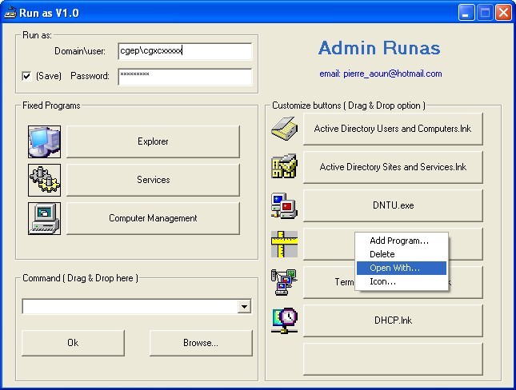



## Admin Runas

### Description

A simple Runas, You can run a program as any UserName you like, just drag &amp; drop a program or browse destination. You can customize the icons too&#8230;

All the settings include password are stocked in the registry (HKEY_CURRENT_USER\Software\VB and VBA Applications\...) encrypted with the drive_C serial number and the computer serial number.
 
### More Info
 

             |
---                |---
**Submitted On**   |2005-06-14 15:43:02
**By**             |[Pierre AOUN](https://github.com/Planet-Source-Code/PSCIndex/blob/master/ByAuthor/pierre-aoun.md)
**Level**          |Intermediate
**User Rating**    |5.0 (15 globes from 3 users)
**Compatibility**  |VB 6\.0
**Category**       |[Windows API Call/ Explanation](https://github.com/Planet-Source-Code/PSCIndex/blob/master/ByCategory/windows-api-call-explanation__1-39.md)
**World**          |[Visual Basic](https://github.com/Planet-Source-Code/PSCIndex/blob/master/ByWorld/visual-basic.md)
**Archive File**   |[Admin\_Runa1901466142005\.zip](https://github.com/Planet-Source-Code/pierre-aoun-admin-runas__1-61135/archive/master.zip)

